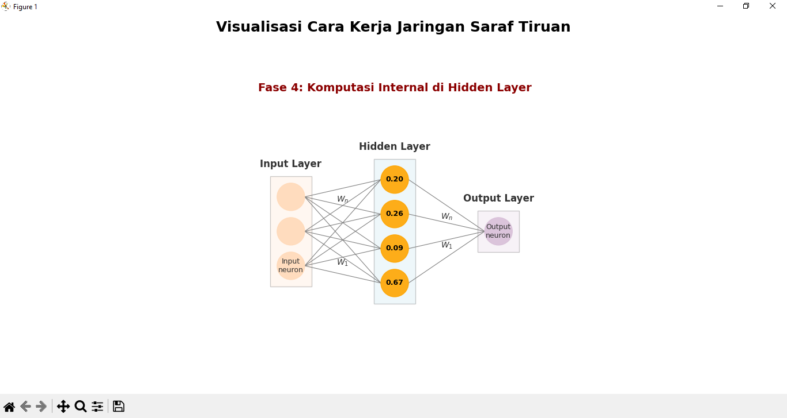

# 🚀 Visualisasi Cara Kerja Jaringan Saraf Tiruan (Neural Network)

Proyek ini adalah sebuah skrip Python yang bertujuan untuk memvisualisasikan konsep Jaringan Saraf Tiruan (JST) secara dinamis. Alih-alih hanya menampilkan arsitektur statis, skrip ini menggunakan Matplotlib dan NumPy untuk membuat animasi langkah-demi-langkah dari **aliran aktivasi data**.

Visualisasi ini dirancang agar mudah dipahami, menunjukkan bagaimana data masuk melalui **Input Layer**, diproses di **Hidden Layer**, dan akhirnya menghasilkan **Output Layer**. Tampilan dipercantik dengan kotak yang jelas untuk setiap lapisan agar terlihat rapi dan profesional.

---

## 🖼️ Tampilan Demo

Berikut adalah tangkapan layar dari salah satu fase animasi, menunjukkan aliran aktivasi dari Hidden Layer ke Output Layer.



---

## 📈 Fitur Utama

- **Animasi Multi-Fase**: Menampilkan 6 fase terpisah, mulai dari input data hingga output akhir.
- **Tampilan Terstruktur**: Setiap lapisan (Input, Hidden, Output) ditempatkan dalam kotak terpisah untuk kejelasan visual.
- **Teks Penjelasan Dinamis**: Teks di bagian atas diperbarui di setiap fase untuk menjelaskan apa yang sedang terjadi.
- **Visualisasi Aktivasi**: Menampilkan nilai aktivasi (angka acak simulasi) di dalam neuron saat aktif.
- **Arah Aliran yang Jelas**: Menggunakan panah berwarna untuk menunjukkan arah aliran data (aktivasi) secara eksplisit.

---

## 🛠️ Instalasi

Untuk menjalankan proyek ini di komputer lokal Anda, ikuti langkah-langkah berikut:

1.  **Clone Repositori**

    ```bash
    git clone https://github.com/the-clone-xyz/visualisasi-neuron-network-dengan-python.git
    cd visualisasi-neuron-network-dengan-python
    ```

2.  **Buat File `requirements.txt`**
    Buat sebuah file baru di dalam folder proyek Anda dengan nama `requirements.txt` dan isi dengan:

    ```
    matplotlib
    numpy
    ```

3.  **Instalasi Dependensi**
    Jalankan perintah berikut di terminal Anda untuk menginstal pustaka yang diperlukan:
    ```bash
    pip install -r requirements.txt
    ```
    _(Disarankan untuk menggunakan virtual environment Python untuk proyek ini)_

---

## 💻 Cara Menjalankan

Setelah instalasi selesai, jalankan skrip Python utama dari terminal:

```bash
python main.py
```
